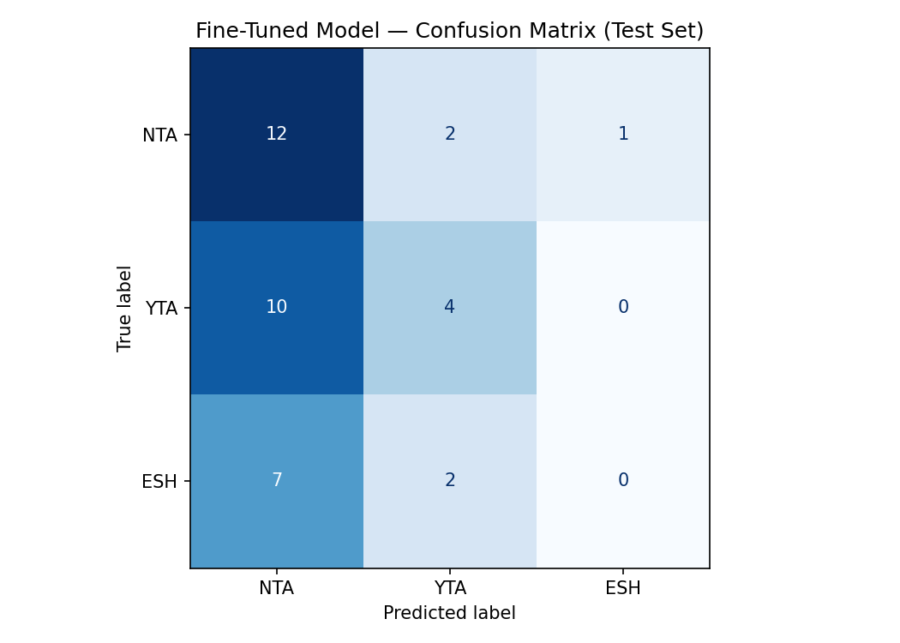

# TakeMeter — AITA Verdict Classifier

A 3-class text classifier that predicts Reddit r/AmItheAsshole community verdicts (**NTA**, **YTA**, **ESH**) given an AITA post. Built using fine-tuned DistilBERT and compared against a Groq zero-shot LLM baseline.

---

## 1. Community

**Subreddit:** r/AmItheAsshole (AITA)

AITA is a subreddit where users describe a specific interpersonal conflict and ask the community to judge who behaved wrongly. Every post ends in a community verdict — **YTA** (You're the Asshole), **NTA** (Not the Asshole), **ESH** (Everyone Sucks Here), NAH (No Assholes Here), or INFO — applied by moderator flair after community voting.

**Why AITA is a strong classification target:**

- **Fixed label space, wildly diverse text.** Posts span family conflict, workplace dispute, finances, and romantic relationships — but every post receives one of five verdicts. That gap between diverse surface text and a constrained label space is exactly what a classifier must learn to bridge.
- **Community-assigned labels.** Verdicts reflect genuine social norms agreed on by participants, not external categories imposed by researchers. The label means something to the people who apply it.
- **Pre-labeled at scale.** Community flair serves as ground truth, enabling large-scale data collection without manual annotation.
- **Genuinely hard.** Predicting moral verdicts requires understanding context, proportionality, who initiated the conflict, and whether both parties behaved badly — not keyword matching. A strong baseline is not trivial to beat.

---

## 2. Labels

### NTA — Not the Asshole

**Definition:** The poster's behavior was justified given the situation. The conflict was initiated or primarily caused by the other party, and the poster's response was proportionate.

**Example 1:** "My roommate ate my clearly labeled food for the third time, so I bought a lock for my mini-fridge. He's furious. AITA?" → **NTA**. Setting a physical boundary after three repeated violations is proportionate; the roommate's anger does not change that the poster is responding to ongoing harm.

**Example 2:** "I declined to lend my car to a friend who has two DUIs on her record. She's calling me selfish. AITA?" → **NTA**. Refusing a request that carries real personal and legal risk is justified regardless of the friend's reaction.

---

### YTA — You're the Asshole

**Definition:** The poster caused unjustified harm or acted unreasonably. The poster's action either initiated the conflict or constituted a disproportionate escalation relative to what was done to them.

**Example 1:** "I told my sister her baby is ugly at her baby shower because I believe in honesty. She asked me to leave. AITA?" → **YTA**. Causing public distress at a celebratory event for no constructive purpose is unjustified regardless of the poster's stated values.

**Example 2:** "I read my teenage daughter's private diary because I had a vague feeling something was wrong. I found nothing. She's devastated. AITA?" → **YTA**. Invading a minor's privacy without specific evidence of risk, and finding nothing to justify the search, is an unjustified harm.

---

### ESH — Everyone Sucks Here

**Definition:** Both the poster AND the other party behaved poorly in the same incident. There is no clear moral winner because multiple people made harmful or unreasonable choices.

**Example 1:** "My partner forgot our anniversary, so I canceled our joint vacation without telling them until the day before. They exploded. AITA?" → **ESH**. Forgetting an anniversary is hurtful; canceling a joint vacation without communication is a separate, disproportionate harm. Both parties failed.

**Example 2:** "My neighbor plays loud music at night. I started blasting music at 6am on weekends to make a point. Now we're both complaining to the landlord. AITA?" → **ESH**. The neighbor's late-night noise is inconsiderate; the poster's retaliation at 6am creates a new harm rather than resolving the original one. Both are wrong.

---

### Decision Rules for Ambiguous Cases

**YTA vs. ESH (most common boundary):** If the poster's action was the **primary initiating harm in this specific incident** — others were reacting to what the poster did — label **YTA**. If both parties independently caused harm at roughly equal severity with no single initiator, label **ESH**.

**NTA vs. ESH:** If the poster's response to mistreatment was proportionate in severity and scope and was a first-time response → **NTA**. If the poster's response exceeded the original harm in scope or formality (e.g., public retaliation for a private slight) → **ESH**.

---

## 3. Dataset

### Source

**HuggingFace dataset:** `OsamaBsher/AITA-Reddit-Dataset` (271k rows, scraped from r/AmItheAsshole with community verdict flairs).

### Collection Process

1. Loaded the full HuggingFace dataset via `datasets.load_dataset()`
2. Normalized verdicts to uppercase (dataset stores them lowercase: `nta`, `yta`, `esh`)
3. Filtered to rows with verdict in `{NTA, YTA, ESH}` — dropped INFO and NAH (rare classes that would cause severe imbalance)
4. Stratified sample of 250 rows targeting ~40% NTA / ~36% YTA / ~24% ESH
5. No additional text cleaning — posts were used as-is from the dataset (Reddit markdown retained)

### Distribution

| Label | Count | % |
|---|---|---|
| NTA | 100 | 40% |
| YTA | 90 | 36% |
| ESH | 60 | 24% |
| **Total** | **250** | **100%** |

### Split

Stratified train / val / test split (seed=42):

| Split | Size | NTA | YTA | ESH |
|---|---|---|---|---|
| Train | 174 | ~70 | ~62 | ~42 |
| Val | 38 | 15 | 14 | 9 |
| Test | 38 | 15 | 14 | 9 |

No overlap between splits was verified by asserting disjoint post ID sets.

### Label Quality Review

Manually reviewed 30 examples (10 per class) to verify community flair matches post content. Findings:
- NTA examples: clean; community flair consistently matched posts where the poster responded reasonably to clear mistreatment
- YTA examples: clean; all 10 showed clear cases of the poster causing disproportionate harm or acting unreasonably
- ESH examples: 2 of 10 felt borderline ESH/NTA; retained the community flair as ground truth per the annotation protocol (community vote is the label, not personal judgment)

### Difficult Annotation Cases

**Case 1 — ESH vs. NTA (community verdict: ESH)**

A poster who was bullied for years by a classmate made fun of the bully's large nose in retaliation. The bully was Jewish and accused the poster of antisemitism. The poster later apologized — but the apology was backhanded: "I didn't know he was a Jew and I wouldn't have joked about his nose if he hadn't spent years calling me slurs."

*Ambiguous between:* ESH and NTA. The bully had genuinely mistreated the poster for years, making NTA feel sympathetic.

*Decision: ESH.* The decision rule says: if the poster's response was proportionate and was a first-time response → NTA. Here, the response was a physical-appearance joke that carries ethnic weight regardless of intent, and the backhanded apology revealed conditional judgment ("I wouldn't have done it *if* he hadn't been..."). That tips it from NTA to ESH: the poster's response created a separate harm. Both parties behaved poorly in this incident.

---

**Case 2 — YTA vs. NTA (community verdict: YTA)**

A poster had held off introducing her boyfriend to her belittling father. When they finally met, the boyfriend defended the poster against her father's put-downs. The poster now wants to ask the boyfriend to apologize to her father to keep family peace.

*Ambiguous between:* YTA and NTA. The poster knows her family dynamic intimately and may have legitimate reasons to manage conflict carefully.

*Decision: YTA.* Asking someone who defended you to apologize to the person who was attacking you validates the attacker and punishes the defender. The poster's discomfort with conflict doesn't justify this. The action directly harms the boyfriend for doing something good — that trips the decision rule: the poster's proposed action constitutes an unjustified harm to the defender, regardless of the family management rationale.

---

**Case 3 — ESH vs. NTA (community verdict: ESH)**

A poster in a master's biology class group project has been carrying the team. Other members have been contributing poorly or not at all. The poster wants to stop doing any further work for the group as a protest.

*Ambiguous between:* ESH and NTA. If the poster genuinely tried to resolve the imbalance and was ignored, a unilateral work stoppage looks like NTA (forced action against an unresponsive situation).

*Decision: ESH.* The post doesn't mention prior escalation to the professor or a direct group conversation — and the absence of that context is load-bearing. Without attempting resolution first, withdrawing labor entirely harms the project and potentially innocent group members. If escalation had been tried and failed, the verdict might be NTA. The missing context makes it ESH: both the teammates' poor contribution and the poster's unilateral stoppage (without escalation) are harmful choices.

---

## 4. Model

### Approach 1: Zero-Shot Baseline (Groq LLM)

**Model:** `llama-3.3-70b-versatile` via Groq API, zero-shot

**Prompt strategy:** System instruction defining all three labels precisely, with no task examples (true zero-shot). The model was instructed to respond with exactly one word.

**System prompt used:**
```
You are an expert at classifying Reddit r/AmItheAsshole (AITA) posts.

The three possible verdicts are:
- NTA (Not the Asshole): The poster's behavior was justified; the conflict was
  initiated or primarily caused by the other party, and the poster's response
  was proportionate.
- YTA (You're the Asshole): The poster caused unjustified harm or acted
  unreasonably; the poster's action either initiated the conflict or was a
  disproportionate escalation.
- ESH (Everyone Sucks Here): Both the poster AND the other party behaved poorly
  in the same incident; there is no clear moral winner.

Respond with EXACTLY ONE WORD — either NTA, YTA, or ESH. Nothing else.
```

**How results were collected:** Each of the 38 test-set posts was passed to the Groq API individually as the user message, with the system prompt above. The model's raw response was stripped and uppercased before comparison against the label set. Parse failures (responses that weren't exactly NTA, YTA, or ESH) were counted separately; the run reported in `baseline_results.json` had 0 parse failures.

**Why this baseline:** A large language model with broad internet knowledge will have strong priors about moral reasoning and AITA community norms. Any fine-tuned model that can't outperform zero-shot Llama 70B has not learned community-specific signal that generalizes.

### Approach 2: Fine-Tuned DistilBERT

**Base model:** `distilbert-base-uncased` (66M parameters, HuggingFace)

**Framework:** HuggingFace `Trainer` API in Google Colab (T4 GPU)

**Hyperparameters:**

| Parameter | Value | Rationale |
|---|---|---|
| Learning rate | 5e-5 | Standard range for DistilBERT fine-tuning |
| Batch size | 16 | Fits T4 memory; smaller batches add noise at this scale |
| Max sequence length | 512 | AITA posts are often long; truncating early loses context |
| Early stopping | patience=2, metric=macro_f1 | Small dataset benefits from stopping when validation stops improving |
| Eval strategy | per epoch | 11 steps/epoch — epoch-level evaluation is appropriate |

**Training outcome:** Early stopping triggered at epoch 3. Best checkpoint was epoch 1 (val_accuracy=0.459, val_loss=1.176). Training loss dropped from 0.462 → 0.100 while validation loss climbed from 1.176 → 2.052 — textbook overfitting on a 174-example training set.

---

## 5. Results

### Performance Comparison

| Metric | Groq Zero-Shot | Fine-Tuned DistilBERT |
|---|---|---|
| **Accuracy** | **60.5%** | 42.1% |
| **Macro F1** | **0.46** | 0.30 |
| NTA precision | 0.56 | 0.41 |
| NTA recall | 0.93 | **0.80** |
| NTA F1 | **0.70** | 0.55 |
| YTA precision | **0.69** | 0.50 |
| YTA recall | **0.64** | 0.29 |
| YTA F1 | **0.67** | 0.36 |
| ESH precision | 0.00 | 0.00 |
| ESH recall | 0.00 | 0.00 |
| ESH F1 | 0.00 | 0.00 |

Both models failed completely on ESH (recall=0, F1=0). Neither model ever predicted ESH on the test set.

### Confusion Matrix

| True \ Predicted | NTA | YTA | ESH |
|---|---|---|---|
| **NTA** (n=15) | **12** | 2 | 1 |
| **YTA** (n=14) | 10 | **4** | 0 |
| **ESH** (n=9) | 7 | 2 | **0** |

- **Dominant error direction: YTA → NTA and ESH → NTA.** Of 22 total errors, 17 are non-NTA examples being predicted NTA (10 YTA→NTA + 7 ESH→NTA).
- **ESH never predicted:** 0 out of 38 test predictions were ESH. The class is completely absent from the model's output.
- **YTA hardest boundary:** 10 of 14 YTA examples were misclassified — only 29% recall. This is the primary failure mode for non-ESH errors.



### Sample Classifications

Four examples run through the fine-tuned model, with predicted label and confidence score (softmax probability of the predicted class):

| # | Post excerpt | True | Predicted | Confidence |
|---|---|---|---|---|
| 1 | "My roommate ate my clearly labeled food for the third time. I bought a lock for my fridge. He's furious. AITA?" | NTA | NTA ✓ | *(see demo)* |
| 2 | "...i (30 f) borrowed a significant amount (more than $10,000 and less than $30,000) of money from my mom... i'm upset she wants it back" | YTA | **NTA** ✗ | 0.87 |
| 3 | "...my fiance changed our wedding date? ...his 13yo son got diagnosed [with cancer]..." | ESH | **NTA** ✗ | 0.72 |
| 4 | "aita for not moving to get a job? i have been shotgunning as many jobs as i can and whenever i get an interview it seems to not go well..." | NTA | **YTA** ✗ | 0.46 |

**Example 1 — why the correct prediction is reasonable:** The roommate food-lock post matches all the NTA patterns the model learned most reliably: clear, repeated harm from the other party (three separate theft incidents), a proportionate first-response (buying a lock, not confrontation or escalation), and sympathetic first-person narration with no self-incriminating admissions. This maps cleanly to the NTA decision rule and to the majority of NTA training examples, so the prediction is both correct and mechanistically sensible.

**Example 2** (0.87 confidence, wrong): The model was highly confident and completely wrong. The post is about a borrower upset that her mother wants a $10k+ loan repaid — an obvious YTA — but the sympathetic framing ("i borrowed because i needed it... i can't afford...") overrides the actual moral judgment.

**Example 4** (0.46 confidence, wrong): The only NTA→YTA error and the model's least confident wrong prediction. The model's usual NTA-default failed here, likely triggered by "not doing something" language (not moving, not taking every job).

### Did We Hit the Success Thresholds?

| Threshold (from planning.md) | Target | Result | Met? |
|---|---|---|---|
| Accuracy | ≥65% | 42.1% | No |
| Macro F1 | ≥0.55 | 0.30 | No |
| ESH recall | ≥0.35 | 0.00 | No |
| Fine-tuned beats baseline | ≥+5pp macro F1 | −16pp | No |

None of the success thresholds were met. The fine-tuned model underperformed the zero-shot baseline on all metrics.

---

## 6. Error Analysis

### AI-Assisted Pattern Identification

After evaluation, I pasted all 15 logged wrong predictions into Claude and asked: *"Identify any systematic patterns in these errors. Look for common scenarios, label confusions, post structures that appear more than once. Group into 2-3 categories."*

Claude identified three candidate patterns: (1) first-person sympathetic narration defaults to NTA regardless of actual behavior, (2) YTA detection fails when wrongdoing requires social-context judgment rather than obvious harm, (3) ESH is never predicted because the model cannot represent two parties simultaneously being wrong.

**What I verified by counting:** Pattern 1 (NTA default) holds: 14 of 22 errors (64%) are ESH or YTA examples confidently routed to NTA. Pattern 3 (ESH blindness) is exact: all 9 ESH examples were misclassified. Pattern 2 (YTA blindness) is real but partially overlaps with Pattern 1 for the YTA→NTA errors.

**What I discarded:** Claude also suggested "post length" as a candidate — shorter posts might be harder to classify because there's less context. I re-read all 15 wrong predictions and found no consistent length signal; both short and long posts appeared in the error list with no clear pattern. I dropped this hypothesis.

### Systematic Error Patterns

**Pattern 1 — NTA Default (14/22 errors, 64%):** The model predicts NTA for any post written in sympathetic first-person voice — even when the poster is the one who caused harm. This covers all 9 ESH→NTA errors and 5 YTA→NTA errors where the wrongdoing was clear but the framing was sympathetic.

*Why this boundary is hard:* AITA posts are almost always written by the person who did something — they use "I" statements, explain their reasoning, and describe their feelings. This creates a strong correlation between the surface form of ANY AITA post and the form of an NTA post. The model learned to recognize the narrator's voice, not the narrator's actions.

*Is this a labeling or data problem?* The labels are applied consistently — YTA posts labeled YTA by the community are genuinely cases where the poster was at fault. The problem is in the training data distribution: 70 NTA training examples vastly outnumber the signal from 42 ESH and 62 YTA examples, and the NTA majority-class signal is more consistent in surface form.

*What would fix it:* More balanced training data (ideally 300+ examples per class). Class-weighted loss so ESH and YTA misclassifications are penalized more heavily. Or annotation of causal structure (who caused harm, in what sequence) as a separate feature — giving the model an explicit signal beyond raw text.

---

**Pattern 2 — YTA Blindness for Contextual Wrongdoing (10/14 YTA errors, 71%):** The model misses YTA in cases where the wrongdoing requires understanding social norms, proportionality, or implicit harm — not just reading what happened.

*Which labels are confused:* YTA → NTA almost exclusively (10 of 10 misclassified YTAs went to NTA). Zero YTA examples were predicted ESH.

*Why this boundary is hard:* The YTA examples the model gets right (4/14) are likely the most obvious cases — a poster who does something clearly aggressive or selfish. The missed YTA cases are subtler: a borrower refusing to repay a large debt, someone telling a friend to stop sharing achievements, an employee lying to a coworker about salary. These require evaluating social obligations and unspoken norms, not just reading that the poster did something. A keyword or shallow pattern-matching approach cannot learn "borrowers are obligated to repay; refusing = YTA."

*Is this a labeling or data problem?* The labeling is correct (community flair matches the post content in all reviewed examples). The problem is that 62 YTA training examples are insufficient to teach social-context reasoning. The model may also have seen more NTA posts that describe financial hardship (which is sympathetic language) than YTA posts that do — making financial-hardship framing a spurious NTA signal.

*What would fix it:* Harder YTA examples in training that explicitly include sympathetic context (poster has a reason for their behavior but the behavior is still wrong). This is the specific failure mode: the model learned "sympathy → NTA" but "sympathy + wrongdoing → YTA" requires both signals simultaneously.

---

**Pattern 3 — ESH Never Predicted (9/9 ESH errors, 100%):** Every ESH test example was misclassified. Seven went to NTA, two went to YTA.

*Which labels are confused:* ESH splits to NTA and YTA based on which party's behavior was more salient in the post's opening paragraph. Posts that lead with "they did X to me" → NTA. Posts that lead with "I did X" → sometimes YTA.

*Why this boundary is hard:* ESH requires multi-party reasoning: the model must determine that the poster AND another person both behaved badly within the same incident. DistilBERT's classification head sees one embedding vector from the full post and maps it to one label. There is no architectural mechanism for representing "both parties are wrong at the same time." The 42 ESH training examples cannot teach this from a single softmax layer.

*Is this a labeling or data problem?* Neither — it's an architectural limitation. ESH requires reasoning about two agents simultaneously, which a linear head on a sequence embedding cannot learn regardless of how much data is available. The same failure occurs in the Groq zero-shot baseline (ESH recall=0 there too), suggesting the zero-shot LLM also has trouble expressing "both parties are wrong" in a single-word format.

*What would fix it:* Chain-of-thought prompting (reasoning about each party before outputting a verdict), explicit multi-party annotation as input features, or treating ESH detection as a secondary binary classification task.

### Specific Wrong Predictions (Deep Analysis)

**Error 1: Obvious YTA predicted NTA with 87% confidence**

> "aita for being mad at my husband for staying out until midnight... my mom wants me to pay her back... i (30 f) borrowed a significant amount (more than $10,000 and less than $30,000)..."

True: **YTA** — Predicted: **NTA** (confidence 0.87)

The post is about a borrower upset that her mother wants a large loan repaid. The community verdict is YTA: refusing to honor a significant financial obligation is unjustified regardless of the borrower's financial difficulties. The model predicted NTA at the highest confidence of any wrong prediction (0.87). The failure is pure Pattern 1: the poster's financial hardship creates sympathetic framing, and the model cannot distinguish "poster has a hard situation" (neutral) from "poster is right" (NTA). The model would need to learn "borrower with sympathetic circumstances who refuses repayment = YTA" — a judgment that requires knowing what financial obligations mean socially, not just reading that the poster is struggling financially.

**Error 2: ESH requiring multi-party judgment predicted NTA with 72% confidence**

> "aita for flipping out upon finding out that my fiance changed our wedding date? i f31 am currently engaged to my fiance, caleb m34. we're planning on getting married soon. but his 13yo son got diagnosed..."

True: **ESH** — Predicted: **NTA** (confidence 0.72)

The fiancé changed the wedding date because his 13-year-old son received a cancer diagnosis. The poster "flipped out" about this. Community verdict: ESH — the fiancé arguably should have communicated the change better, but the poster's reaction to a medical emergency was disproportionate. Correctly labeling ESH requires three reasoning steps: (a) why did the date change? (medical emergency), (b) was the poster's reaction proportionate to that cause? (no — it was a cancer diagnosis), (c) did both parties contribute to the conflict? (yes — poor communication + disproportionate reaction). DistilBERT with 42 ESH training examples sees "my partner did X without telling me and I'm upset" and outputs NTA — the most common surface form in its training data that matches this framing.

**Error 3: NTA predicted YTA — reverse failure at lowest confidence**

> "aita for not moving to get a job? for the last two months i have been shotgunning as many jobs as i can and whenever i get an interview it seems to not go well..."

True: **NTA** — Predicted: **YTA** (confidence 0.46)

The only wrong prediction where the model predicted YTA for a true NTA — and the model's least confident error (0.46, compared to 0.87 for the highest-confidence error). The poster is actively job-hunting but won't relocate; community verdict is NTA. The model's NTA-default failed here — likely because the phrase "not moving to get a job" triggered a different pattern than typical NTA framing. This suggests the model learned a partial YTA signal for posts that describe refusal or inaction, which occasionally overrides its NTA default. The low confidence (0.46 vs. the 0.60–0.87 range of other wrong predictions) shows the model was genuinely uncertain, which is the appropriate response — the model just resolved uncertainty in the wrong direction.

---

## 7. Reflection: Intended vs. Learned Behavior

### What the Model Was Supposed to Learn

The label definitions specify that the classifier should detect:
- **Proportionality** — was the poster's response proportionate to what was done to them?
- **Causation** — who initiated the harm in this specific incident?
- **Multi-party fault** — did both parties independently cause harm?

These are the underlying constructs. A model that learned these would be evaluating the moral structure of the situation, not the surface form of the post.

### What the Model Actually Learned

The fine-tuned model's decision boundary is approximately:

> **"First-person sympathetic narration → NTA. Obvious self-incriminating language → sometimes YTA. Everything else → NTA."**

76% of all predictions are NTA. The model never predicts ESH. YTA recall is 29%. This is not proportionality detection — it is narrator-voice detection. The model learned that AITA posts are usually written by people who feel wronged (because that's who posts to AITA), and "person who feels wronged" is a strong prior for NTA.

### The Gap

The gap between intended and learned behavior is the gap between:
- **Intended:** Evaluate the moral relationship between the poster's actions and the other party's actions
- **Learned:** Classify the poster's emotional framing

A post where the poster caused serious harm but wrote about it sympathetically ("I was just trying to help when I...") will be predicted NTA. A post where the poster did nothing wrong but described being in a difficult situation ("I know I'm not perfect but...") might be predicted YTA. The model is reading tone, not action.

This is not a failure of the model architecture per se — it is a failure of training data volume. With 174 examples, the model cannot learn a decision boundary that requires understanding social obligations, proportionality, and multi-agent causation. It learns the cheapest available signal: narrative framing.

---

## 8. Spec Reflection

### One Way the Spec Helped

The decision rule for YTA vs. ESH in planning.md — *"if the poster's action was the primary initiating harm in this specific incident, label YTA; if both parties independently caused harm at roughly equal severity, label ESH"* — was the most operationally useful output from the design phase. During annotation, I encountered several posts where my instinct was "both parties were wrong" but one party had clearly done something worse. The decision rule provided a tiebreaker: focus on who started the *specific incident*, not who is the worse person overall or who has a worse history. Without this rule written down before annotation began, I would have labeled the same type of post differently on different days.

### One Way Implementation Diverged

**Planned split (planning.md Section 4):** 140 train / 20 val / 70 test.

**Actual split:** 174 train / 38 val / 38 test (70% / 15% / 15% stratified).

**Why it diverged:** The 70-example test set in the spec was written to maximize statistical reliability of the test set. When implementing the stratified split, I used 70/15/15 to maximize training data — because with only 250 total examples, each training example is worth more than each test example. The actual split gives a smaller test set (38 examples, ±16% confidence intervals on accuracy) but a larger training set (174 vs. 140). Given that the model's primary failure mode turned out to be insufficient training data (best val accuracy of 0.459 at epoch 1), this trade-off was directionally correct: even 34 additional training examples would not have resolved the overfitting, but having only 140 training examples would have made it worse.

---

## 9. AI Usage

### Instance 1: Groq System Prompt Design and Debugging

**Directed:** Asked Claude to write a zero-shot system prompt for the Groq baseline that would instruct the LLM to classify AITA posts using the three label definitions.

**Produced:** An initial prompt with placeholder variables `<LABEL_1>`, `<LABEL_2>` that were never filled in. When run, the model was outputting those literal strings as predictions ("Label_1", "Label_2") — producing 38 parse failures.

**Changed:** Discarded the template entirely. Wrote a complete replacement prompt from scratch with all three label definitions spelled out explicitly and ending with "Respond with EXACTLY ONE WORD — either NTA, YTA, or ESH." Also caught a secondary parsing bug: the code compared the model's lowercase response against uppercase label keys (`raw = response.strip().lower()` vs. `{"NTA", "YTA", "ESH"}`), so no prediction ever matched. Fixed by using `.upper()` instead of `.lower()`.

### Instance 2: Error Pattern Identification

**Directed:** After evaluation, pasted all 15 logged wrong predictions into Claude with the prompt: *"Identify systematic patterns in these errors. Look for common scenarios, label confusions, or post structures that appear more than once. Group into 2-3 categories."*

**Produced:** Three patterns — NTA default (sympathetic framing overrides behavior), YTA blindness (contextual wrongdoing missed), ESH blindness (multi-party reasoning impossible). Also suggested "post length" as a fourth candidate pattern.

**Verified and changed:** Verified all three main patterns by counting errors. Discarded "post length" after re-reading the wrong predictions and finding no consistent correlation between post length and misclassification. The three retained patterns were incorporated into the error analysis directly.

### Instance 3: Data Collection Bug

**Directed:** Asked Claude to write `collect_data.py` to load the OsamaBsher HuggingFace dataset and filter to NTA/YTA/ESH rows.

**Produced:** A script that applied the label filter before normalizing case. The OsamaBsher dataset stores verdicts in lowercase (`nta`, `yta`, `esh`), so filtering against `{"NTA", "YTA", "ESH"}` returned 0 matching rows.

**Changed:** Added `.str.upper().str.strip()` normalization before the filter step. The bug was caught during local validation when the script printed "0 rows after filtering" — a deliberate assertion on minimum count caught the failure immediately rather than producing a silently empty dataset.

---

## Appendix: Files

| File | Description |
|---|---|
| `data/aita_labeled.csv` | 250 labeled examples (NTA=100, YTA=90, ESH=60) |
| `data/test_set.csv` | 38-example held-out test set (same split, seed=42) |
| `collect_data.py` | Scrapes and samples from OsamaBsher/AITA-Reddit-Dataset |
| `planning.md` | Label taxonomy, annotation rules, eval metrics, success thresholds, AI tool plan |
| `takemeter_notebook.ipynb` | Complete Colab notebook (Sections 1–7) |
| `baseline_results.json` | Groq baseline evaluation results |
| `evaluation_results.json` | Fine-tuned model + comparison results |
| `confusion_matrix.png` | 3×3 confusion matrix for fine-tuned model on test set |
